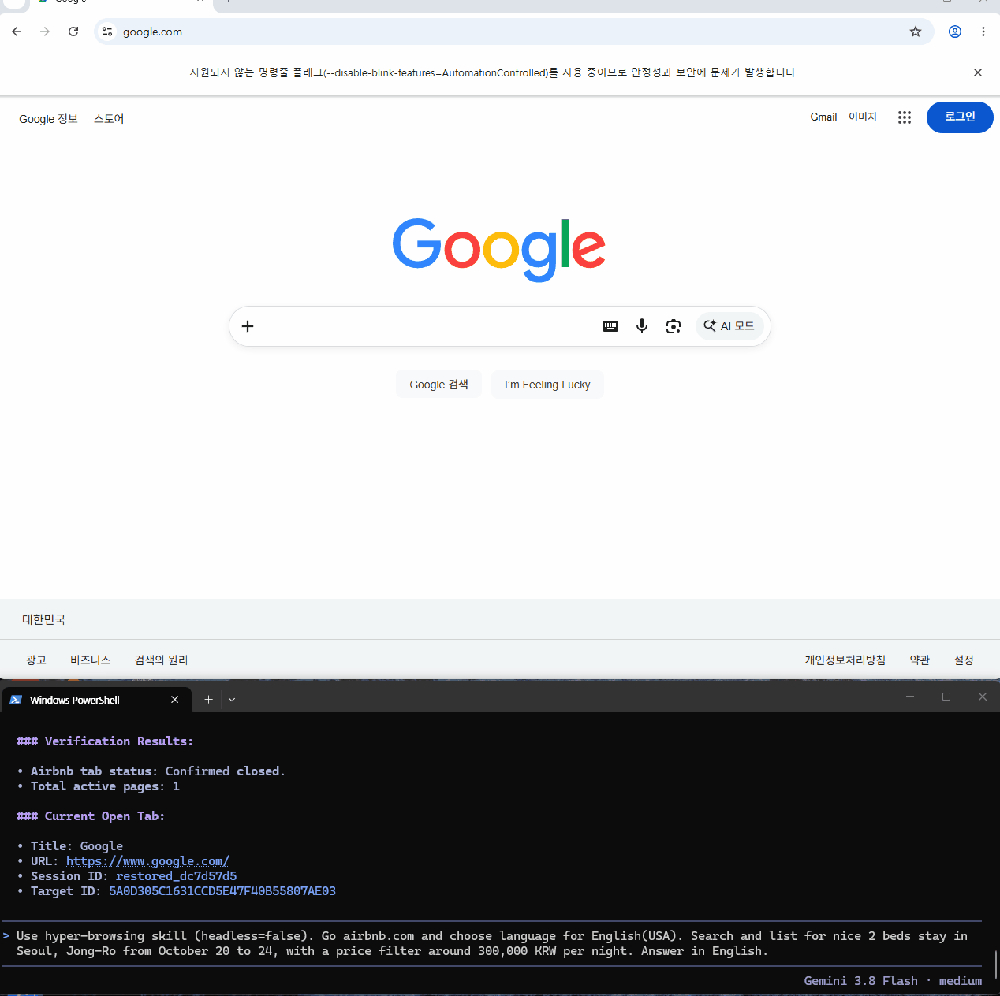
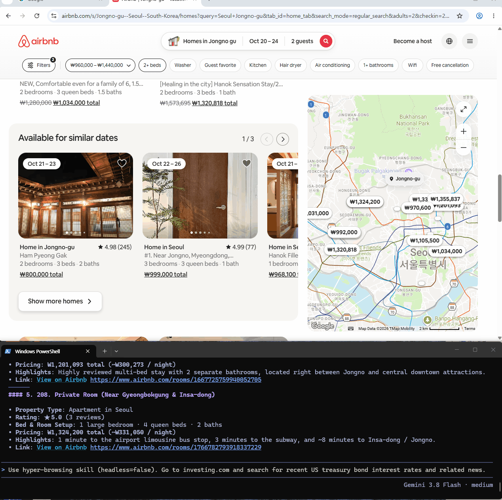

# Hyper-Browsing

<p align="right">
  <strong>English</strong> · <a href="./README.ko.md">한국어</a>
</p>

<p>
  <a href="./LICENSE"></a>
</p>

> - **Enables AI agents to rapidly inspect and interact with any website through Playwright, leveraging your real Chrome browser profile.**
> - **Self-learns and turns successful interactions into dedicated scripts and knowledge docs for blazing-fast execution on subsequent visits.**
> - **Ultra-fast, adaptive web browsing agent skill.**

---

### 🎬 Demo

#### 1) Known Site: Ultra-Fast Execution via Ready-Made Script (`Airbnb`)
- **Scenario**: The agent has visited Airbnb before and assetized it into a dedicated script.
- **Behavior**: Directly invokes the pre-built `airbnb_runner.mjs` without redundant DOM re-analysis or selector probing, delivering results in seconds.

<p align="center">
  
</p>

#### 2) New Site: Zero-Shot Browsing via Built-in Core Tools (`Investing.com`)
- **Scenario**: First time visiting Investing.com with no pre-existing site scripts.
- **Behavior**: Uses standard built-in discovery tools (`forms`, `smart-scroll`, `diff`) to inspect interactive elements and navigate the site adaptively.

<p align="center">
  
</p>

---

### ⚡ Highlights & Core Strengths

| Feature | Key Advantage |
| :--- | :--- |
| ⚡ **Super Fast** | Runs verified site runners directly without DOM re-analysis |
| 🪙 **Token-Light** | Filters heavy DOMs locally in Node.js, saving 90%+ context tokens |
| 🔑 **Login-Ready** | Reuses your real Chrome profile & cookies; zero repetitive logins |
| 🧠 **Self-Evolving** | Auto-detects broken selectors and heals scripts via discovery fallback |
| 🛠️ **Self-Customizing** | Permanently encodes proven paths as local `<site>_runner.mjs` assets |
| 🔒 **100% Private** | Runs purely on `localhost:9223`; zero data sent to external servers |

---

### 1. Core Value Proposition (3-Stage Evolution Cycle)

```text
┌────────────────────────────────────────────────────────────────────────┐
│ Stage 1: Fast Zero-Shot Inspection & Interaction                       │
│  - Rapidly scans DOM elements/structures to enable instant Playwright actions │
└──────────────────────────────────┬─────────────────────────────────────┘
                                   │
                                   ▼
┌────────────────────────────────────────────────────────────────────────┐
│ Stage 2: Deep Analysis via Standard Tooling Suite                      │
│  - Virtual DOM scrolling, live WebSocket sniffing, diffing, user intervention│
└──────────────────────────────────┬─────────────────────────────────────┘
                                   │
                                   ▼
┌────────────────────────────────────────────────────────────────────────┐
│ Stage 3: Permanent Assetization & Acceleration                         │
│  - Saves successful interaction paths as <site>_runner.mjs & SKILL.md  │
│  - Subsequent requests run verified scripts directly without re-analysis│
└────────────────────────────────────────────────────────────────────────┘
```

---

### 2. How It Works

#### 1) Instant Element Inspection & Native Chrome Playwright Connection
- Never stalls or wastes token context trying to dump massive raw DOM trees.
- Rapidly extracts interactable elements (buttons, inputs, key cards) into a clean, compact representation so the agent can click and type immediately.
- Operates directly on the user's authentic Chrome profile session via CDP, seamlessly inheriting existing logins and credentials.

#### 2) Top 6 Core Built-in Discovery & Interaction Tools
Equipped with 6 battle-tested primitives to handle modern dynamic web complexities (SPAs, virtual DOMs, popups, live streams):

1. **`dismiss-annoyances` (Blocking Overlay Cleaner)**:
   - Automatically clicks or DOM-purges cookie banners, newsletter modals, and transparent backdrops that intercept pointer events, instantly unlocking body scroll.
2. **`forms` (Input Form Structure Scanner)**:
   - Scans `<form>` containers to extract input names, labels, placeholders, required flags, and submit buttons in a single structured JSON schema.
3. **`smart-scroll` (Virtual DOM Accumulator)**:
   - Continuously accumulates feed and listing nodes in memory while scrolling, preventing data loss from off-screen virtual DOM unmounting.
4. **`diff` (State Transition & Error Verifier)**:
   - Compares before-and-after snapshots of an action to detect URL changes, modal appearances, and system error alerts (`role="alert"`).
5. **`api-sniff` / `sniff-ws` (Network & WebSocket Sniffers)**:
   - Bypasses fragile DOM parsing by intercepting internal REST JSON responses and live WebSocket message streams directly from the network layer.
6. **`user-intervene` (Human-in-the-Loop Helper)**:
   - Gracefully surfaces the visible Chrome window and pauses execution when human intervention (2FA, CAPTCHAs, payments) is required, then safely resumes.

#### 3) Permanent Assetization into Dedicated Scripts & Knowledge Docs
- Successful interaction workflows are never thrown away.
- Saved under `sites/<domain>/`:
  1. **Site Knowledge Document (`SKILL.md`)**: Records layouts, query quirks, and resilient selector strategies.
  2. **Universal CLI Runner (`<site>_runner.mjs`)**: Encapsulates navigation, filters, and extraction into clean CLI options.
- **Fast-Path on Return Visits**:  
  When the user makes another request for the same site, the agent skips zero-shot discovery and **calls the verified runner script directly**, responding in seconds.

---

### 3. Execution Walkthrough

#### [New Site Scenario: Discovery → Analysis → Assetization]
- **User Prompt**: *"Check the stock and price of product X on new shopping mall Y."*
- **Agent Workflow**:
  1. **Inspection**: Launches Chrome, navigates to the site, and scans buttons and input fields.
  2. **Tooling**: Uses `smart-scroll` to aggregate product listings and extracts targeted prices.
  3. **Reporting & Assetization**: Delivers the result to the user, then saves the proven search/extract workflow into `sites/y_mall/scripts/y_mall_runner.mjs` and `SKILL.md`.

#### [Known Site Scenario: Blazing-Fast Direct Path]
- **User Prompt**: *"Summarize the top 3 latest posts from my LinkedIn feed."*
- **Agent Workflow**:
  1. **Asset Detection**: Instantly spots existing `sites/linkedin/SKILL.md` and `linkedin_runner.mjs`.
  2. **Direct Execution**: Runs `node sites/linkedin/scripts/linkedin_runner.mjs feed --limit 3` without selector probing.
  3. **Instant Response**: Retrieves feed posts under the authenticated session and delivers the summary in seconds.

---

### 4. Built-in Pre-Assetized Site Runners

Ready for instant out-of-the-box execution:
- **Social / Communities**: LinkedIn (`linkedin_runner.mjs`), X/Twitter (`x_runner.mjs`), Threads (`threads_runner.mjs`), Instagram (`instagram_runner.mjs`)
- **E-Commerce / Booking / Travel**: KREAM (`kream_runner.mjs`), Airbnb (`airbnb_runner.mjs`), Ticketmaster (`ticketmaster_runner.mjs`), Skyscanner (`skyscanner_runner.mjs`)
- **Finance / Research / Data**: Coinbase (`coinbase_runner.mjs`), Hyperliquid (`hyperliquid_runner.mjs`), TradingView (`tradingview_runner.mjs`), arXiv (`arxiv_runner.mjs`), Google Trends (`googletrends_runner.mjs`), Naver Real Estate (`naverland_runner.mjs`)

---

### 5. Handling Website Redesigns (Self-Healing)

When a target website changes its DOM and breaks an existing script, the system gracefully recovers:

1. **Fail-Fast Detection**: Enforces 3–5s timeouts on locators to fail fast rather than hanging for 30s.
2. **Automatic Fallback to Discovery**: Reverts to Stage 1 zero-shot mode using `dismiss-annoyances`, `diff`, and `forms` to uncover the new layout and complete the user task.
3. **Self-Healing Update**: Overwrites and patches `sites/<site>/` runners and docs with the newly discovered selectors.

---

### 6. Storage & Session Maintenance

Redundant background model stores, shader caches, and temporary files are blocked proactively. You can clean up runtime bloat with a single command while **100% preserving user login sessions (Cookies)**:

```bash
npm run clean
```

---

### 7. Installation & Environment Setup

Requires **Node.js 20+** and **Google Chrome** installed on your machine.

#### Instruct Your AI Agent (Easiest Method)
Paste this single prompt into your AI coding agent (Claude Code, Antigravity, Hermes, etc.):

> 💬 *"Clone https://github.com/miter37/hyper-browsing into my skills directory, run npm install, and run health check so it's ready to use."*

##### 🤖 Steps for User or Agent to Execute:
1. **Clone to Skills Directory**:
   Clone or link into your agent's skills directory (`~/.agents/skills/`):
   ```bash
   git clone https://github.com/miter37/hyper-browsing.git
   cd hyper-browsing
   ```
   *(※ The agent recognizes `SKILL.md` and automatically adopts it for browser tasks.)*

2. **Install Dependencies**:
   ```bash
   npm install
   ```
   *(※ The `playwright` package is installed automatically. Since this skill controls your real installed Google Chrome via CDP, downloading heavy Chromium binaries (`npx playwright install`) is NOT required.)*

3. **Verify Daemon & Chrome Health**:
   Start the browser daemon and verify `status: "ok"`:
   ```bash
   # Windows
   bin\webctl.cmd health

   # macOS / Linux
   ./bin/webctl health
   ```

---

### 8. How to Prompt Your Agent (3 Practical Examples)

#### Example 1) Authenticated Social Account Task
> 💬 *"Go to my Threads feed, read the top 5 recent posts, and summarize key trends in 3 bullet points."*
- **Expected Agent Reaction**: Connects to Threads using the preserved login session and runs `threads_runner.mjs` to fetch and brief the feed.

#### Example 2) Complex Real-Time Booking / Search Task
> 💬 *"Use hyper-browsing skill to visit Ticketmaster, and find concerts or shows in Seoul on October 8 suitable to watch with my 20-something daughter."*
- **Expected Agent Reaction**: Navigates the booking portal, manipulates date/city/genre filters, and compiles available shows.

#### Example 3) New Site Discovery & Explicit Assetization Request
> 💬 *"Go to https://news.ycombinator.com, extract today's top 10 posts with titles, URLs, and upvotes. Once done, assetize it into a dedicated script so we can use it fast next time."*  
> *(※ Agents often self-learn autonomously, but explicit prompts guarantee dedicated script creation.)*
- **Expected Agent Reaction**: Discovers DOM elements, extracts items, and generates `sites/news_ycombinator_com/` runner and skill docs.

---

### 9. Why a 100% Local Skill Beats Remote MCP & Cloud Browsers

Unlike cloud-hosted browsers or heavy MCP (Model Context Protocol) servers:

- 🔒 **Zero Data Leakage**: Runs 100% on `localhost:9223`. Not a single byte of your cookies, tokens, or browsing data ever leaves your computer.
- ⚡ **No Context Window Saturation**: MCP forces massive raw DOM trees into your LLM prompt, exploding token bills and causing lag. Hyper-Browsing processes and filters DOMs locally in Node.js, returning only compact, sanitized results.
- 🧠 **A Skill That Evolves Custom to You**: Fixed MCP servers cannot self-code. Hyper-Browsing writes reusable `<site>_runner.mjs` files directly to your local drive, continuously adapting and evolving into your personalized browsing fleet.
- 💸 **Zero Extra Subscriptions**: No third-party proxy fees, no CAPTCHA-solving subscriptions, and no Docker overhead. Your existing Chrome is all it needs.

---

### 10. Privacy & Security Policy

- **No credentials, login cookies, tokens, or personal identifiers are stored in this repository.**
- All session profiles and cookies stay strictly isolated in your local `.runtime/` directory and are completely excluded from Git tracking.

---
